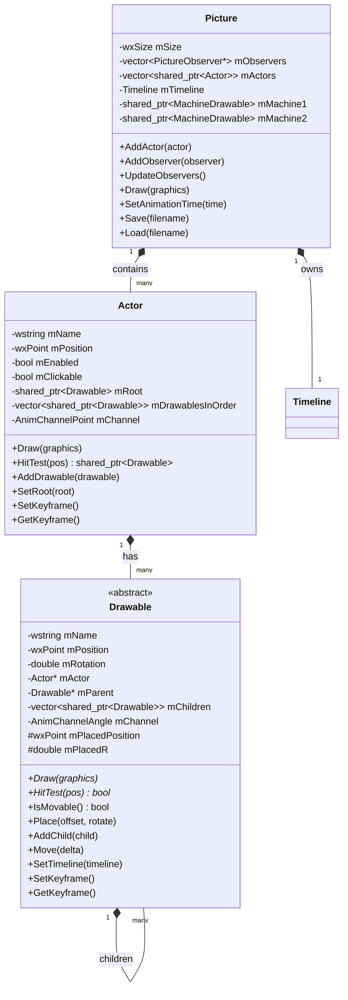
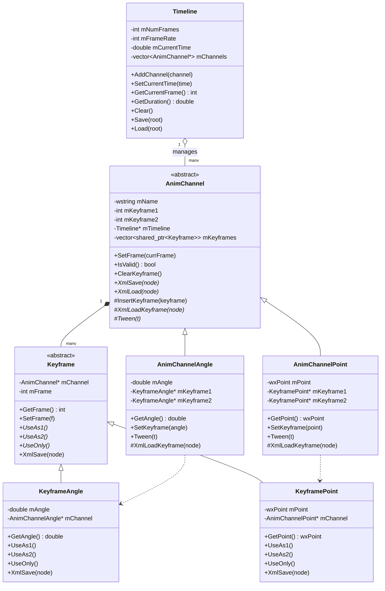
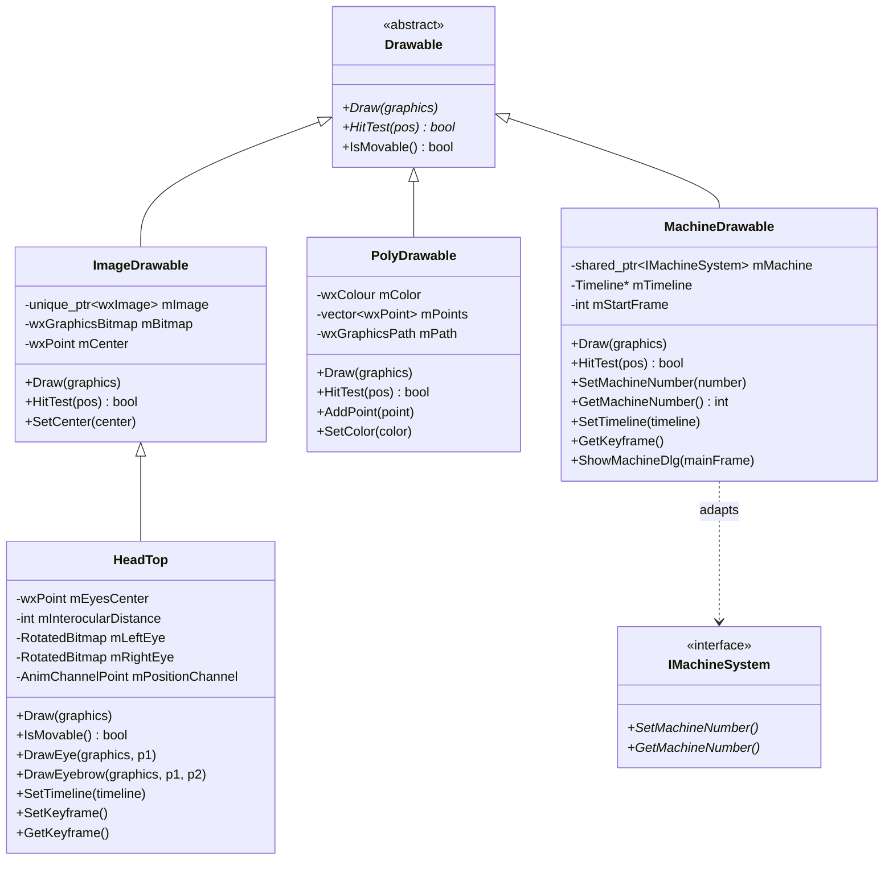
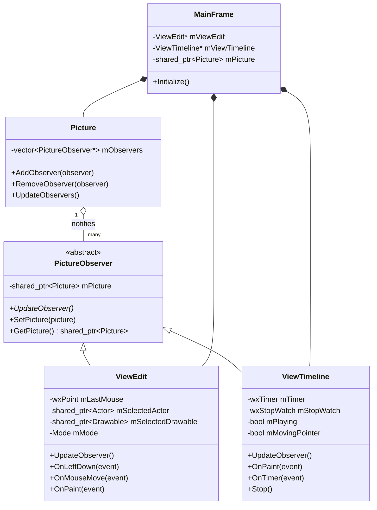
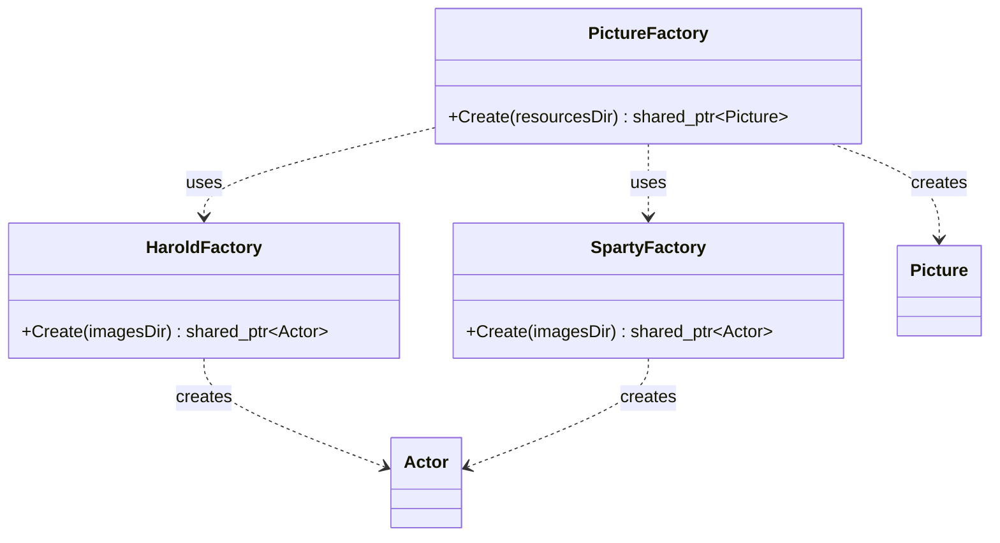

# OOP Animation Editor — 2D Keyframe Animation System

A C++ desktop animation application built with **wxWidgets**, implementing a keyframe-based 2D character animation system. Characters (actors) are composed of hierarchical drawable parts that can be independently positioned, rotated, and animated over a timeline.

---

## Table of Contents

- [Overview](#overview)
- [Features](#features)
- [Build Requirements](#build-requirements)
- [Project Structure](#project-structure)
- [System Architecture](#system-architecture)
- [Class Diagrams](#class-diagrams)
  - [Core Domain](#core-domain-class-diagram)
  - [Animation System](#animation-system-class-diagram)
  - [UI Layer (Observer Pattern)](#ui-layer--observer-pattern)
  - [Factory Pattern](#factory-pattern)
- [Design Patterns](#design-patterns)
- [Component Descriptions](#component-descriptions)
- [Data Flow](#data-flow)

---

## Overview

OOP Animation Editor is a 2D keyframe animation editor that allows users to:
- Place animated characters (Harold, Sparty) into a scene
- Attach interactive machines to the scene via an adapter interface
- Scrub through a frame-based timeline and set keyframes
- Interpolate (tween) between keyframes for smooth animation
- Save and load animation state as XML

---

## Features

| Feature | Description |
|---|---|
| Keyframe Animation | Set position/rotation keyframes per drawable |
| Tweening | Linear interpolation between keyframes |
| Multiple Characters | Harold and Sparty actors, each with articulated body parts |
| Machine Integration | External machines embedded via Adapter pattern |
| Observer-driven UI | Two views (Edit + Timeline) auto-update via Observer pattern |
| XML Persistence | Full save/load of animation state |
| Mouse Interaction | Click to select, drag to move/rotate drawables |

---

## Build Requirements

- **C++17** or later
- **wxWidgets 3.x** (GUI framework)
- **CMake 3.15+**
- Machine API library (`machine-api.h`)

```bash
mkdir build && cd build
cmake ..
cmake --build .
```

---

## Project Structure

```
OOP-Animation-Editor/
└── KeyframeAnimationSystem/
    ├── CanadianExperienceApp.cpp/.h     # wxApp entry point
    ├── CMakeLists.txt
    └── CanadianExperienceLib/
        ├── MainFrame.h/.cpp             # Top-level window
        ├── ViewEdit.h/.cpp              # Canvas view (Observer)
        ├── ViewTimeline.h/.cpp          # Timeline view (Observer)
        │
        ├── Picture.h/.cpp              # Scene container
        ├── PictureObserver.h/.cpp      # Observer base class
        ├── PictureFactory.h/.cpp       # Builds the full scene
        │
        ├── Actor.h/.cpp                # Character container
        ├── HaroldFactory.h/.cpp        # Builds Harold actor
        ├── SpartyFactory.h/.cpp        # Builds Sparty actor
        │
        ├── Drawable.h/.cpp             # Abstract drawable part
        ├── ImageDrawable.h/.cpp        # Bitmap-based drawable
        ├── PolyDrawable.h/.cpp         # Polygon-based drawable
        ├── HeadTop.h/.cpp              # Specialized head drawable
        ├── MachineDrawable.h/.cpp      # Adapter for IMachineSystem
        ├── RotatedBitmap.h/.cpp        # Rotated bitmap renderer
        │
        ├── Timeline.h/.cpp             # Frame/time manager
        ├── AnimChannel.h/.cpp          # Abstract animation channel
        ├── AnimChannelAngle.h/.cpp     # Angle interpolation channel
        └── AnimChannelPoint.h/.cpp     # Position interpolation channel
```

---

## System Architecture

The application is divided into four main layers:

```
┌─────────────────────────────────────────────────────┐
│                   UI Layer (wxWidgets)               │
│         MainFrame → ViewEdit + ViewTimeline         │
└───────────────────────┬─────────────────────────────┘
                        │ Observer Pattern
┌───────────────────────▼─────────────────────────────┐
│                  Domain Layer                        │
│         Picture ──▶ Actor ──▶ Drawable (tree)       │
└───────────────────────┬─────────────────────────────┘
                        │
┌───────────────────────▼─────────────────────────────┐
│               Animation Layer                        │
│      Timeline ──▶ AnimChannel ──▶ Keyframes         │
└───────────────────────┬─────────────────────────────┘
                        │ Adapter Pattern
┌───────────────────────▼─────────────────────────────┐
│              External Machine API                    │
│                 IMachineSystem                       │
└─────────────────────────────────────────────────────┘
```

---

## Class Diagrams

### Core Domain Class Diagram



---

### Animation System Class Diagram



---

### Drawable Inheritance Hierarchy



---

### UI Layer / Observer Pattern



---

### Factory Pattern



---

## Design Patterns

### 1. Observer Pattern
**Where:** `Picture` (Subject) → `PictureObserver` → `ViewEdit`, `ViewTimeline`

`Picture` maintains a list of observers. When the animation time changes or state is modified, `Picture::UpdateObservers()` notifies all registered views to redraw themselves. This decouples the domain model from the UI completely.

```
Picture::UpdateObservers()
    └─► ViewEdit::UpdateObserver()     → redraws canvas
    └─► ViewTimeline::UpdateObserver() → redraws timeline
```

---

### 2. Factory Method Pattern
**Where:** `PictureFactory`, `HaroldFactory`, `SpartyFactory`

Character construction is encapsulated in dedicated factory classes. `PictureFactory::Create()` assembles the full scene by delegating character creation to `HaroldFactory` and `SpartyFactory`, keeping complex object construction outside of the domain classes themselves.

---

### 3. Composite Pattern
**Where:** `Drawable` parent/child tree inside each `Actor`

Each `Drawable` can have child `Drawable` objects, forming a tree. `Place()` recursively propagates position and rotation transformations down the tree — so moving a body part (e.g. torso) automatically moves all attached children (arms, head, etc.).

```
Actor
 └── Body (PolyDrawable)           ← root
      ├── LeftArm (PolyDrawable)
      ├── RightArm (PolyDrawable)
      └── HeadTop (HeadTop)
           ├── LeftEye (RotatedBitmap)
           └── RightEye (RotatedBitmap)
```

---

### 4. Adapter Pattern
**Where:** `MachineDrawable` adapts `IMachineSystem` into `Drawable`

The external machine library exposes an `IMachineSystem` interface. `MachineDrawable` wraps it as a standard `Drawable`, allowing machines to be inserted into an `Actor`'s drawable tree and participate in the animation timeline without any changes to the machine library.

```
Drawable (interface expected by the system)
    └── MachineDrawable
            └── IMachineSystem  ← external API, unchanged
```

---

### 5. Template Method Pattern
**Where:** `AnimChannel` base class

`AnimChannel::SetFrame()` is the template method — it calls the abstract `Tween(t)` and `XmlLoadKeyframe(node)` hooks, which subclasses (`AnimChannelAngle`, `AnimChannelPoint`) implement with type-specific interpolation logic. The frame-selection algorithm is shared; only the data-type behavior varies.

---

## Component Descriptions

| Class | Role |
|---|---|
| `CanadianExperienceApp` | wxWidgets application entry point (`OnInit`) |
| `MainFrame` | Top-level window; owns `ViewEdit`, `ViewTimeline`, and `Picture` |
| `Picture` | Central scene object — holds all actors, the timeline, and machine references |
| `Actor` | A character in the scene. Owns a tree of `Drawable` parts and a position `AnimChannelPoint` |
| `Drawable` | Abstract base for a single visual component. Has position, rotation, parent/child links, and an angle channel |
| `ImageDrawable` | Renders a bitmap image at a computed position/rotation |
| `HeadTop` | Extends `ImageDrawable` to draw procedural eyes and eyebrows; has its own `AnimChannelPoint` for head position |
| `PolyDrawable` | Renders a filled polygon from a list of points |
| `MachineDrawable` | Adapts `IMachineSystem` into the `Drawable` interface |
| `RotatedBitmap` | Utility for rendering a bitmap with arbitrary rotation |
| `Timeline` | Tracks frame count, frame rate, current time; owns all registered `AnimChannel` pointers |
| `AnimChannel` | Abstract channel storing keyframes for one animatable property |
| `AnimChannelAngle` | Concrete channel that interpolates `double` angles (radians) |
| `AnimChannelPoint` | Concrete channel that interpolates `wxPoint` positions |
| `PictureObserver` | Abstract observer; subclassed by any UI view that needs to react to picture changes |
| `ViewEdit` | Scrollable canvas showing the scene; handles mouse selection, move, and rotate |
| `ViewTimeline` | Scrollable canvas showing the animation timeline; handles playback, keyframe setting |
| `PictureFactory` | Assembles a `Picture` with actors and machines from resource directories |
| `HaroldFactory` | Builds the Harold character as an `Actor` with attached drawables |
| `SpartyFactory` | Builds the Sparty character as an `Actor` with attached drawables |

---

## Data Flow

### Rendering Flow

```
MainFrame::Initialize()
    └─► PictureFactory::Create()
            └─► HaroldFactory::Create()  → builds Actor + Drawables
            └─► SpartyFactory::Create()  → builds Actor + Drawables
            └─► MachineDrawable created  → wraps IMachineSystem

ViewEdit::OnPaint()
    └─► Picture::Draw(graphics)
            └─► for each Actor
                    └─► Actor::Draw(graphics)
                            └─► Drawable::Place(offset, rotate)  ← recursive tree traversal
                            └─► Drawable::Draw(graphics)
```

### Animation Flow

```
User drags timeline pointer
    └─► ViewTimeline::OnMouseMove()
            └─► Picture::SetAnimationTime(t)
                    └─► Timeline::SetCurrentTime(t)
                            └─► for each AnimChannel
                                    └─► AnimChannel::SetFrame(frame)
                                            └─► Tween(t)  ← interpolates keyframes
                    └─► Picture::UpdateObservers()
                            └─► ViewEdit::UpdateObserver()   → Refresh()
                            └─► ViewTimeline::UpdateObserver() → Refresh()
```

### Keyframe Save/Load (XML)

```
Picture::Save(filename)
    └─► Timeline::Save(xmlRoot)
            └─► for each AnimChannel
                    └─► AnimChannel::XmlSave(node)
                            └─► for each Keyframe
                                    └─► Keyframe::XmlSave(node)

Picture::Load(filename)
    └─► Timeline::Load(xmlRoot)
            └─► AnimChannel::XmlLoad(node)
                    └─► XmlLoadKeyframe(node)  ← creates typed Keyframe objects
```
